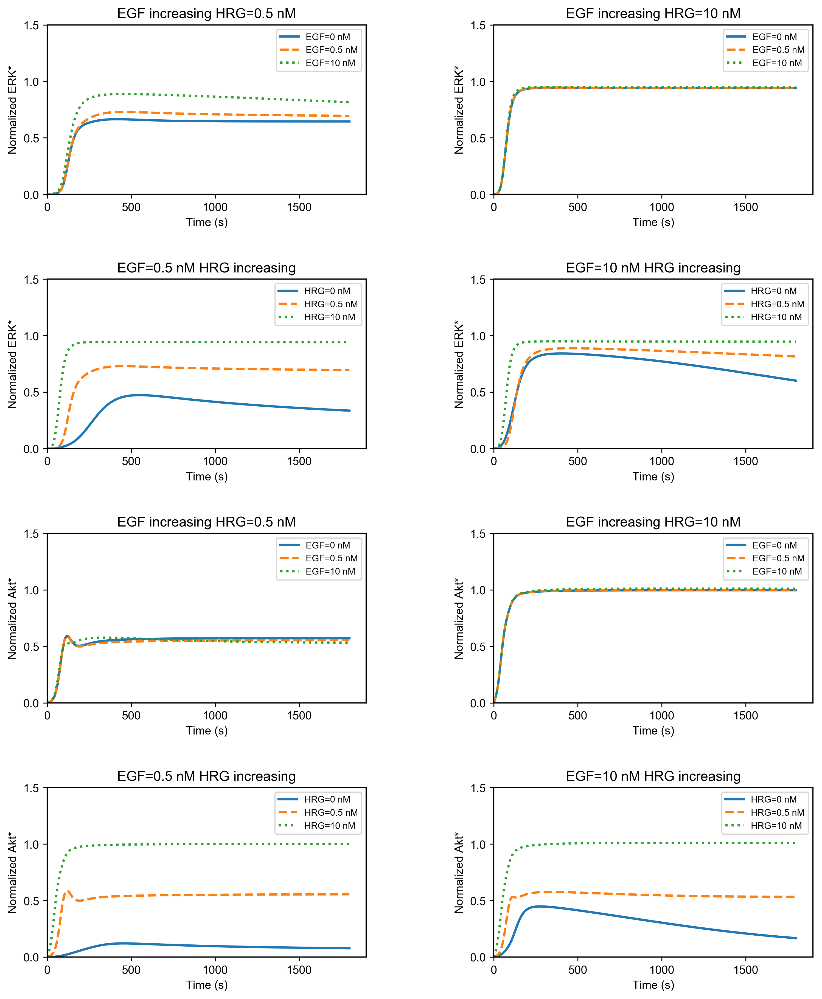

# Birtwistle2007
Birtwistle, M. R. *et al.* Ligand-dependent responses of the ErbB signaling network: Experimental and modeling analyses. *Mol. Syst. Biol.* **3**, (2007). https://doi.org/10.1038/msb4100188

## Requirements
- **[Python3+](https://www.python.org)**
    - numpy
    - scipy
    - matplotlib
    - jupyter

- **[Julia 1.0+](https://julialang.org)**
    - [Sundials](https://github.com/JuliaDiffEq/Sundials.jl)
    - [PyPlot](https://github.com/JuliaPy/PyPlot.jl)
    - [IJulia](https://github.com/JuliaLang/IJulia.jl)

## Run Simulation and View Results
- python
```python
%matplotlib inline
from run_sim import run_simulation
run_simulation()
```

- julia
```julia
include("Birtwistle2007.jl")
using .Birtwistle2007
runSim()
```


## Installation
    $ git clone https://github.com/okadalabipr/Birtwistle2007.git

## License
[MIT](/LICENSE)